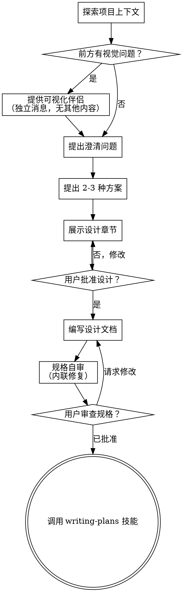

# 将创意头脑风暴为设计方案

通过自然的协作对话，帮助将创意转化为完整的设计和规格说明。

首先了解当前项目上下文，然后逐个提问来完善创意。一旦你理解了要构建的内容，就展示设计方案并获得用户批准。

<HARD-GATE>
在你展示设计方案并获得用户批准之前，不要调用任何实现技能、编写任何代码、搭建任何项目或采取任何实现行动。这适用于每个项目，无论其看起来多么简单。
</HARD-GATE>

## 反模式："这太简单了，不需要设计"

每个项目都要经过这个流程。待办事项列表、单函数工具、配置更改——全部都要。"简单"的项目恰恰是未经审视的假设导致最多无用功的地方。设计可以很简短（对于真正简单的项目只需几句话），但你必须展示它并获得批准。

## 检查清单

你必须为以下每个项目创建任务，并按顺序完成：

1. **探索项目上下文** — 检查文件、文档、最近的提交
2. **提供可视化伴侣**（如果主题涉及视觉问题）— 这是一条独立消息，不与澄清问题合并。参见下方的可视化伴侣部分。
3. **提出澄清问题** — 每次一个，理解目的/约束/成功标准
4. **提出 2-3 种方案** — 包含权衡分析和你的推荐
5. **展示设计** — 按复杂度分节展示，每节之后获取用户批准
6. **编写设计文档** — 保存到 `docs/superpowers/specs/YYYY-MM-DD-<topic>-design.md` 并提交
7. **规格自审** — 快速内联检查占位符、矛盾、歧义、范围（见下文）
8. **用户审查已编写的规格** — 在继续之前请用户审查规格文件
9. **过渡到实现** — 调用 writing-plans 技能创建实现计划

## 流程图

**终态是调用 writing-plans。** 不要调用 frontend-design、mcp-builder 或任何其他实现技能。头脑风暴之后你唯一调用的技能是 writing-plans。

## 流程详解

**理解创意：**

- 首先查看当前项目状态（文件、文档、最近的提交）
- 在提出详细问题之前，评估范围：如果请求描述了多个独立子系统（例如，"构建一个包含聊天、文件存储、计费和分析的平台"），立即标记出来。不要花时间细化一个需要先分解的项目的细节。
- 如果项目对于单个规格来说太大，帮助用户分解为子项目：独立的部分是什么，它们如何关联，应该按什么顺序构建？然后通过正常的设计流程对第一个子项目进行头脑风暴。每个子项目都有自己的规格 → 计划 → 实现周期。
- 对于范围适当的项目，逐个提问来完善创意
- 尽可能使用选择题，但开放式问题也可以
- 每条消息只问一个问题——如果一个主题需要更多探索，将其拆分为多个问题
- 专注于理解：目的、约束、成功标准

**探索方案：**

- 提出 2-3 种不同的方案及其权衡
- 以对话方式展示选项，附上你的推荐和理由
- 先展示你推荐的选项并解释原因

**展示设计：**

- 一旦你认为理解了要构建的内容，就展示设计
- 根据复杂度调整每节的篇幅：简单的几句话，复杂的最多 200-300 字
- 每节之后询问到目前为止是否正确
- 涵盖：架构、组件、数据流、错误处理、测试
- 准备好在某些内容不合理时回头澄清

**为隔离性和清晰性而设计：**

- 将系统拆分为更小的单元，每个单元有一个明确的目的，通过定义良好的接口通信，并且可以独立理解和测试
- 对于每个单元，你应该能够回答：它做什么，如何使用它，它依赖什么？
- 别人能否在不阅读内部实现的情况下理解一个单元的功能？你能否在不破坏消费者的情况下更改内部实现？如果不能，边界需要改进。
- 更小、边界清晰的单元也更容易处理——你对能在上下文中完整把握的代码推理得更好，当文件聚焦时你的编辑也更可靠。当文件变大时，这通常是它承担了太多职责的信号。

**在现有代码库中工作：**

- 在提出更改之前先探索当前结构。遵循现有模式。
- 当现有代码存在影响工作的问题时（例如，文件过大、边界不清、职责纠缠），将有针对性的改进作为设计的一部分——就像优秀的开发者在工作中改进代码一样。
- 不要提出无关的重构。专注于服务当前目标的内容。

## 设计之后

**文档：**

- 将经过验证的设计（规格）写入 `docs/superpowers/specs/YYYY-MM-DD-<topic>-design.md`
  - （用户对规格位置的偏好优先于此默认值）
- 如果可用，使用 elements-of-style:writing-clearly-and-concisely 技能
- 将设计文档提交到 git

**规格自审：**
编写规格文档后，以全新的视角审视它：

1. **占位符扫描：** 是否有 "TBD"、"TODO"、不完整的章节或模糊的需求？修复它们。
2. **内部一致性：** 是否有章节相互矛盾？架构是否与功能描述匹配？
3. **范围检查：** 这是否足够聚焦以用于单个实现计划，还是需要分解？
4. **歧义检查：** 是否有需求可以被两种方式解读？如果是，选择一种并明确说明。

内联修复所有问题。无需重新审查——直接修复并继续。

**用户审查关卡：**
规格审查循环通过后，在继续之前请用户审查已编写的规格：

> "规格已编写并提交到 `<path>`。请审查它，如果你想在我们开始编写实现计划之前做任何更改，请告诉我。"

等待用户的回复。如果他们请求更改，进行更改并重新运行规格审查循环。只有在用户批准后才继续。

**实现：**

- 调用 writing-plans 技能创建详细的实现计划
- 不要调用任何其他技能。writing-plans 是下一步。

## 核心原则

- **每次一个问题** - 不要用多个问题让人应接不暇
- **优先选择题** - 在可能的情况下比开放式问题更容易回答
- **严格遵循 YAGNI** - 从所有设计中移除不必要的功能
- **探索替代方案** - 在确定之前始终提出 2-3 种方案
- **增量验证** - 展示设计，在继续之前获得批准
- **保持灵活** - 当某些内容不合理时回头澄清

## 可视化伴侣

基于浏览器的伴侣工具，用于在头脑风暴期间展示原型、图表和视觉选项。作为工具提供——不是模式。接受伴侣意味着它可用于受益于视觉处理的问题；这并不意味着每个问题都通过浏览器展示。

**提供伴侣：** 当你预计即将到来的问题将涉及视觉内容（原型、布局、图表）时，征求一次同意：
> "我们正在讨论的一些内容如果能在网页浏览器中展示给你看可能会更容易理解。我可以在讨论过程中制作原型、图表、对比和其他视觉内容。这个功能还比较新，可能会消耗较多 token。想试试吗？（需要打开一个本地 URL）"

**此提议必须是独立消息。** 不要将其与澄清问题、上下文摘要或任何其他内容合并。消息应该只包含上述提议，不包含其他任何内容。等待用户回复后再继续。如果他们拒绝，继续纯文本头脑风暴。

**逐问题决策：** 即使用户接受后，也要为每个问题决定使用浏览器还是终端。判断标准：**用户看到它是否比阅读它更容易理解？**

- **使用浏览器** 展示本身就是视觉性的内容——原型、线框图、布局对比、架构图、并排视觉设计
- **使用终端** 展示文本内容——需求问题、概念选择、权衡列表、A/B/C/D 文本选项、范围决策

关于 UI 主题的问题不一定是视觉问题。"在这个上下文中个性化是什么意思？"是概念性问题——使用终端。"哪种向导布局更好？"是视觉问题——使用浏览器。

如果他们同意使用伴侣，在继续之前阅读详细指南：
`skills/brainstorming/visual-companion.md`
