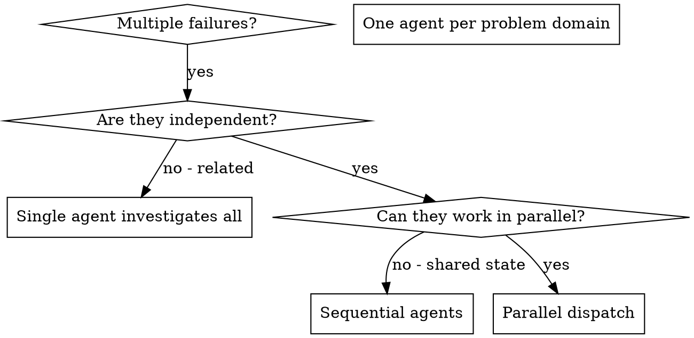

# 调度并行代理

## 概述

你将任务委派给具有隔离上下文的专门代理。通过精确构建它们的指令和上下文，确保它们保持专注并成功完成任务。它们不应继承你会话的上下文或历史记录——你需要精确构建它们所需的内容。这也为你自己保留了用于协调工作的上下文。

当你遇到多个不相关的失败（不同的测试文件、不同的子系统、不同的缺陷）时，逐一调查会浪费时间。每个调查都是独立的，可以并行进行。

**核心原则：** 每个独立问题域调度一个代理。让它们并发工作。

## 何时使用



**适用场景：**
- 3个以上测试文件因不同根因失败
- 多个子系统独立出现故障
- 每个问题无需其他问题的上下文即可理解
- 调查之间没有共享状态

**不适用场景：**
- 失败之间存在关联（修复一个可能修复其他的）
- 需要理解完整的系统状态
- 代理之间会相互干扰

## 模式

### 1. 识别独立域

按故障类型分组：
- 文件 A 测试：工具审批流程
- 文件 B 测试：批量完成行为
- 文件 C 测试：中止功能

每个域都是独立的——修复工具审批不会影响中止测试。

### 2. 创建聚焦的代理任务

每个代理获得：
- **明确范围：** 一个测试文件或子系统
- **清晰目标：** 让这些测试通过
- **约束条件：** 不要修改其他代码
- **预期输出：** 发现和修复内容的摘要

### 3. 并行调度

```typescript
// 在 Claude Code / AI 环境中
Task("Fix agent-tool-abort.test.ts failures")
Task("Fix batch-completion-behavior.test.ts failures")
Task("Fix tool-approval-race-conditions.test.ts failures")
// 三个任务同时运行
```

### 4. 审查与集成

当代理返回时：
- 阅读每个摘要
- 验证修复之间没有冲突
- 运行完整测试套件
- 集成所有更改

## 代理提示结构

好的代理提示应该是：
1. **聚焦的** - 一个明确的问题域
2. **自包含的** - 包含理解问题所需的所有上下文
3. **输出明确的** - 代理应该返回什么？

```markdown
Fix the 3 failing tests in src/agents/agent-tool-abort.test.ts:

1. "should abort tool with partial output capture" - expects 'interrupted at' in message
2. "should handle mixed completed and aborted tools" - fast tool aborted instead of completed
3. "should properly track pendingToolCount" - expects 3 results but gets 0

These are timing/race condition issues. Your task:

1. Read the test file and understand what each test verifies
2. Identify root cause - timing issues or actual bugs?
3. Fix by:
   - Replacing arbitrary timeouts with event-based waiting
   - Fixing bugs in abort implementation if found
   - Adjusting test expectations if testing changed behavior

Do NOT just increase timeouts - find the real issue.

Return: Summary of what you found and what you fixed.
```

## 常见错误

**❌ 范围过大：** "修复所有测试" - 代理会迷失方向
**✅ 具体明确：** "修复 agent-tool-abort.test.ts" - 聚焦的范围

**❌ 缺少上下文：** "修复竞态条件" - 代理不知道在哪里
**✅ 提供上下文：** 粘贴错误信息和测试名称

**❌ 没有约束：** 代理可能会重构所有内容
**✅ 设定约束：** "不要修改生产代码" 或 "只修复测试"

**❌ 输出模糊：** "修好它" - 你不知道改了什么
**✅ 输出明确：** "返回根因和更改内容的摘要"

## 何时不使用

**关联失败：** 修复一个可能修复其他的——先一起调查
**需要完整上下文：** 理解问题需要查看整个系统
**探索性调试：** 你还不知道什么坏了
**共享状态：** 代理会相互干扰（编辑相同文件、使用相同资源）

## 会话中的真实示例

**场景：** 大规模重构后，3个文件中出现6个测试失败

**失败情况：**
- agent-tool-abort.test.ts：3个失败（时序问题）
- batch-completion-behavior.test.ts：2个失败（工具未执行）
- tool-approval-race-conditions.test.ts：1个失败（执行计数 = 0）

**决策：** 独立域——中止逻辑与批量完成和竞态条件各自独立

**调度：**
```
代理 1 → 修复 agent-tool-abort.test.ts
代理 2 → 修复 batch-completion-behavior.test.ts
代理 3 → 修复 tool-approval-race-conditions.test.ts
```

**结果：**
- 代理 1：用基于事件的等待替换了超时
- 代理 2：修复了事件结构缺陷（threadId 位置错误）
- 代理 3：添加了异步工具执行完成的等待

**集成：** 所有修复相互独立，无冲突，完整测试套件通过

**节省时间：** 3个问题并行解决 vs 顺序解决

## 关键优势

1. **并行化** - 多个调查同时进行
2. **聚焦** - 每个代理范围窄，需要跟踪的上下文少
3. **独立性** - 代理之间不会相互干扰
4. **速度** - 3个问题在1个问题的时间内解决

## 验证

代理返回后：
1. **审查每个摘要** - 理解改了什么
2. **检查冲突** - 代理是否编辑了相同的代码？
3. **运行完整套件** - 验证所有修复协同工作
4. **抽查** - 代理可能会犯系统性错误

## 实际影响

来自调试会话（2025-10-03）：
- 3个文件中6个失败
- 3个代理并行调度
- 所有调查同时完成
- 所有修复成功集成
- 代理更改之间零冲突
