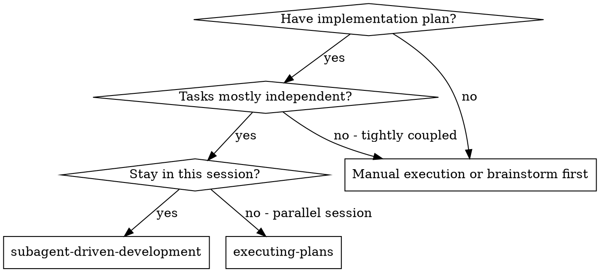
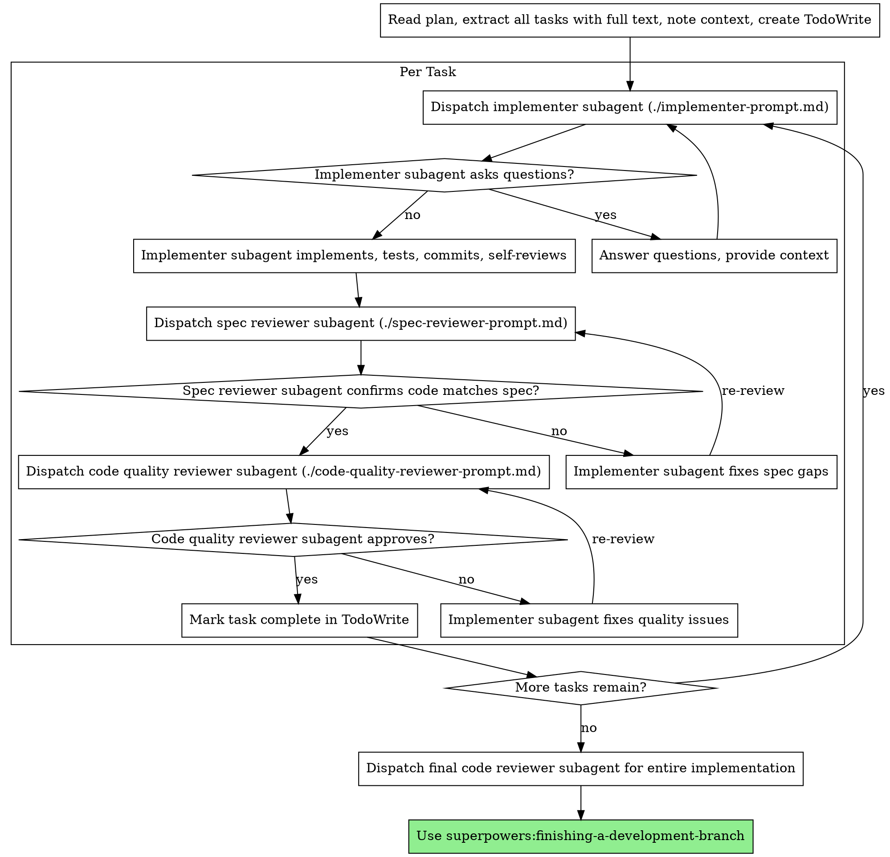

# 子代理驱动开发

通过为每个任务派遣全新的子代理来执行计划，每个任务完成后进行两阶段审查：先进行规格合规审查，再进行代码质量审查。

**为什么使用子代理：** 你将任务委派给具有隔离上下文的专门代理。通过精心构建它们的指令和上下文，你确保它们专注于任务并成功完成。它们不应继承你会话的上下文或历史——你精确构建它们所需的一切。这也为你自己保留了协调工作所需的上下文。

**核心原则：** 每个任务使用全新子代理 + 两阶段审查（规格 + 质量）= 高质量、快速迭代

## 何时使用



**与执行计划（并行会话）的对比：**
- 同一会话（无上下文切换）
- 每个任务使用全新子代理（无上下文污染）
- 每个任务完成后进行两阶段审查：先规格合规，再代码质量
- 更快的迭代（任务之间无需人工介入）

## 流程



## 模型选择

为每个角色使用能胜任的最低能力模型，以节省成本并提高速度。

**机械性实现任务**（独立函数、明确规格、1-2个文件）：使用快速、低成本的模型。当计划规格明确时，大多数实现任务都是机械性的。

**集成和判断任务**（多文件协调、模式匹配、调试）：使用标准模型。

**架构、设计和审查任务**：使用最强大的可用模型。

**任务复杂度信号：**
- 涉及1-2个文件且有完整规格 → 低成本模型
- 涉及多个文件且有集成关注点 → 标准模型
- 需要设计判断或广泛的代码库理解 → 最强大的模型

## 处理实现者状态

实现者子代理报告四种状态之一。对每种状态进行适当处理：

**DONE：** 继续进行规格合规审查。

**DONE_WITH_CONCERNS：** 实现者完成了工作但标记了疑虑。在继续之前阅读这些疑虑。如果疑虑涉及正确性或范围，在审查前解决它们。如果只是观察性意见（例如"这个文件越来越大了"），记录下来并继续审查。

**NEEDS_CONTEXT：** 实现者需要未提供的信息。提供缺失的上下文并重新派遣。

**BLOCKED：** 实现者无法完成任务。评估阻塞原因：
1. 如果是上下文问题，提供更多上下文并使用相同模型重新派遣
2. 如果任务需要更强的推理能力，使用更强大的模型重新派遣
3. 如果任务太大，将其拆分为更小的部分
4. 如果计划本身有误，向人类升级

**绝不要**忽略升级请求或在不做任何改变的情况下强制同一模型重试。如果实现者说它卡住了，就需要做出改变。

## 提示模板

- `./implementer-prompt.md` - 派遣实现者子代理
- `./spec-reviewer-prompt.md` - 派遣规格合规审查子代理
- `./code-quality-reviewer-prompt.md` - 派遣代码质量审查子代理

## 工作流示例

```
You: I'm using Subagent-Driven Development to execute this plan.

[Read plan file once: docs/superpowers/plans/feature-plan.md]
[Extract all 5 tasks with full text and context]
[Create TodoWrite with all tasks]

Task 1: Hook installation script

[Get Task 1 text and context (already extracted)]
[Dispatch implementation subagent with full task text + context]

Implementer: "Before I begin - should the hook be installed at user or system level?"

You: "User level (~/.config/superpowers/hooks/)"

Implementer: "Got it. Implementing now..."
[Later] Implementer:
  - Implemented install-hook command
  - Added tests, 5/5 passing
  - Self-review: Found I missed --force flag, added it
  - Committed

[Dispatch spec compliance reviewer]
Spec reviewer: ✅ Spec compliant - all requirements met, nothing extra

[Get git SHAs, dispatch code quality reviewer]
Code reviewer: Strengths: Good test coverage, clean. Issues: None. Approved.

[Mark Task 1 complete]

Task 2: Recovery modes

[Get Task 2 text and context (already extracted)]
[Dispatch implementation subagent with full task text + context]

Implementer: [No questions, proceeds]
Implementer:
  - Added verify/repair modes
  - 8/8 tests passing
  - Self-review: All good
  - Committed

[Dispatch spec compliance reviewer]
Spec reviewer: ❌ Issues:
  - Missing: Progress reporting (spec says "report every 100 items")
  - Extra: Added --json flag (not requested)

[Implementer fixes issues]
Implementer: Removed --json flag, added progress reporting

[Spec reviewer reviews again]
Spec reviewer: ✅ Spec compliant now

[Dispatch code quality reviewer]
Code reviewer: Strengths: Solid. Issues (Important): Magic number (100)

[Implementer fixes]
Implementer: Extracted PROGRESS_INTERVAL constant

[Code reviewer reviews again]
Code reviewer: ✅ Approved

[Mark Task 2 complete]

...

[After all tasks]
[Dispatch final code-reviewer]
Final reviewer: All requirements met, ready to merge

Done!
```

## 优势

**与手动执行相比：**
- 子代理自然遵循 TDD
- 每个任务使用全新上下文（不会混淆）
- 并行安全（子代理之间不会干扰）
- 子代理可以提问（工作前和工作中都可以）

**与执行计划相比：**
- 同一会话（无交接）
- 持续推进（无需等待）
- 审查检查点自动化

**效率提升：**
- 无文件读取开销（控制器提供完整文本）
- 控制器精确策划所需的上下文
- 子代理预先获得完整信息
- 问题在工作开始前就被提出（而非之后）

**质量关卡：**
- 自审在交接前发现问题
- 两阶段审查：规格合规，然后代码质量
- 审查循环确保修复确实有效
- 规格合规防止过度/不足构建
- 代码质量确保实现质量良好

**成本：**
- 更多子代理调用（每个任务需要实现者 + 2个审查者）
- 控制器需要更多准备工作（预先提取所有任务）
- 审查循环增加迭代次数
- 但能尽早发现问题（比后期调试更便宜）

## 危险信号

**绝不要：**
- 未经用户明确同意就在 main/master 分支上开始实现
- 跳过审查（规格合规或代码质量）
- 在未修复的问题存在时继续推进
- 并行派遣多个实现子代理（会产生冲突）
- 让子代理读取计划文件（应提供完整文本）
- 跳过场景设置上下文（子代理需要理解任务的位置）
- 忽略子代理的问题（在让它们继续之前先回答）
- 接受规格合规的"差不多就行"（规格审查者发现问题 = 未完成）
- 跳过审查循环（审查者发现问题 = 实现者修复 = 再次审查）
- 让实现者的自审替代实际审查（两者都需要）
- **在规格合规通过 ✅ 之前开始代码质量审查**（顺序错误）
- 在任一审查有未解决问题时进入下一个任务

**如果子代理提出问题：**
- 清晰完整地回答
- 如需要，提供额外上下文
- 不要催促它们进入实现阶段

**如果审查者发现问题：**
- 实现者（同一子代理）修复问题
- 审查者再次审查
- 重复直到通过
- 不要跳过重新审查

**如果子代理任务失败：**
- 派遣修复子代理并附上具体指令
- 不要尝试手动修复（上下文污染）

## 集成

**必需的工作流技能：**
- **superpowers:using-git-worktrees** - 必需：开始前设置隔离的工作空间
- **superpowers:writing-plans** - 创建本技能执行的计划
- **superpowers:requesting-code-review** - 审查者子代理的代码审查模板
- **superpowers:finishing-a-development-branch** - 所有任务完成后结束开发

**子代理应使用：**
- **superpowers:test-driven-development** - 子代理为每个任务遵循 TDD

**替代工作流：**
- **superpowers:executing-plans** - 用于并行会话而非同会话执行
